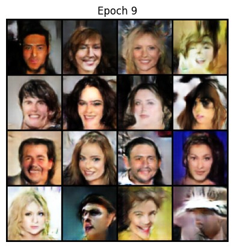
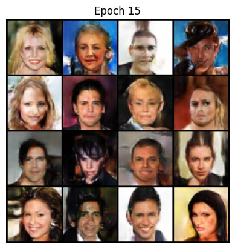
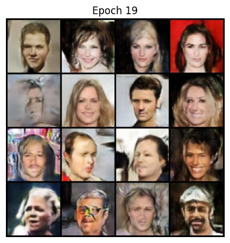

# 🧠 GAN-Based Fake Image Generation (From Scratch)

This project showcases a **from-scratch implementation** of a **Generative Adversarial Network (GAN)** built using only **simple neural networks** — without using any LLMs or pretrained GAN libraries. The aim was to understand the core adversarial learning mechanism by manually designing both networks.

---

## 🧪 What I Did

- Created a basic **GAN architecture** consisting of:
  - 🎨 **Generator**: Tries to create fake images similar to real ones.
  - 🛡️ **Discriminator**: Learns to differentiate between real and fake images.
- Trained both networks in a **min-max adversarial game setup**.
- Wrote the model completely **from scratch** using PyTorch/Keras (no LLMs, no transfer learning).
- Trained for **only 20 epochs** due to:
  - 🚫 **GPU constraints**
  - 📉 **Small dataset**

---

## ⚠️ Limitations

- The **generated images aren't very high quality** because of:
  - Low number of training epochs (20)
  - Limited dataset size
  - No access to high-end GPUs
- However, the results show that even a minimal setup can learn basic image generation.
- With more training time and compute, this setup could generate significantly better outputs.

---

## 📷 Sample Generated Images

Here are a few images generated after just 20 epochs:

  
  
  

> ⚠️ Note: Image quality is limited due to early stopping and constrained resources.

---

## 🚀 Future Improvements

- Train for more epochs (e.g., 100–500+)
- Use a larger and more diverse dataset
- Try convolutional GANs (DCGAN) for better image features
- Experiment with GAN loss functions (e.g., WGAN, LSGAN)

---

## ✅ Tech Stack

- Python
- PyTorch or Keras (whichever you used)
- Matplotlib/Seaborn for visualization
- Numpy and other standard libraries

---

